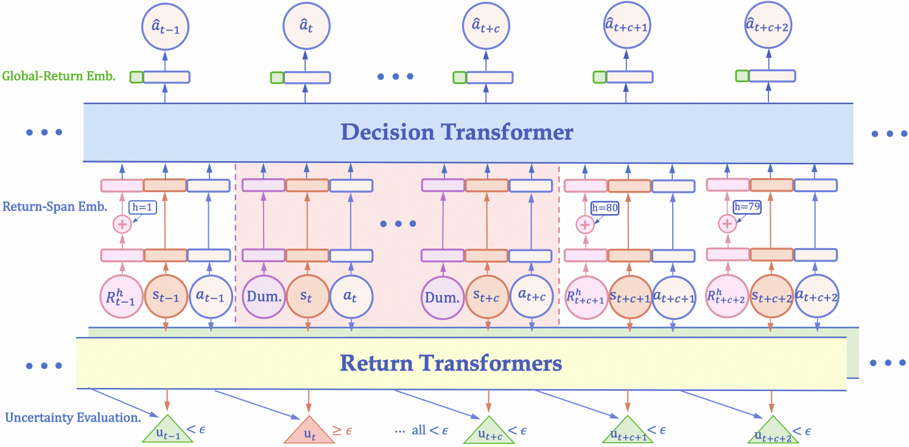

# UNREST
Official implementation for our paper:

[Uncertainty-Aware Decision Transformer for Stochastic Driving Environments](https://openreview.net/forum?id=LiwdXkMsDv)

Zenan Li, Fan Nie, Qiao Sun, Fang Da, Hang Zhao* (* denotes correspondence)

*Conference on Robot Learning* (**CoRL 2024 Oral**)

# Overview
In this repo, we provide necessary codes for training UNREST uncertainty and decision models, and a tiny dataset subsampled from our whole dataset, for demonstration purposes.

Specifically, **UNREST is an uncertainty-aware decision transformer to apply offline RL in stochastic driving environments**.

In this paper, recognizing properties of driving environments, we propose a model-free uncertainty measurement and segment sequences accordingly. Based on these, UNREST replaces global returns in DTs with truncated returns less affected by environments to learn from the actual outcomes of agent actions.


# Environment setup
The training dependencies are relatively simple, simply use:
```
pip install -r requirements.txt
```
for setting up the training environment.

# File Structure
1. config/: This folder includes config files for training return transformers (for uncertainty evaluation), segmenting offline trajectories, and training UNREST decision models.
2. data/: This folder includes the mini-ver. dataset subsampled from the whole Carla offline dataset.
3. dataset/: This folder contains the pytorch trajectory datasets for training UNREST models.
4. model/: This folder contains the base self-attention, GPT modules and return/decision transformers of UNREST.
5. train/: The folder contains the training scripts for return/decision transformers, and the trajectory segmentation code with measured uncertainty.
6. utils/: The utils files to facilitate training, such as the pytorch trainers and tools.

# Instruction Demos
1. First train two return transformers and save the corresponding checkpoints:
```
python -m train.train_return use_value=false # train with the latest action
python -m train.train_return use_value=true # train without the latest action
```
2. Second segment the trajectories and save the index file:
```
python -m train.segment ckpt_return={PATH_TO_RETURN_CKPT} ckpt_value={PATH_TO_VALUE_CKPT}
```
3. Finally train the decision model based on the segmented indice file:
```
python -m train.train_unrest indice_path={PATH_TO_INDEX_FILE}
```
The trained decision model can then be used for planning in long-horizon and uncertain Carla driving environments (omitted in this dem due to complexity).

# Reference
```bibtex
@inproceedings{li2024unrest,
      title = {Uncertainty-Aware Decision Transformer for Stochastic Driving Environments},
      author = {Zenan Li and Fan Nie and Qiao Sun and Fang Da and Hang Zhao},
      booktitle = {Conference on Robot Learning (CoRL)},
      year = {2024}
      }
```

# Acknowledgements
We sincerely thank these repositories: [Roach](https://github.com/zhejz/carla-roach) for its well-implemented CARLA pipeline, and [SPLT](https://github.com/avillaflor/SPLT-transformer) whose models are adopted as our DT baselines. 